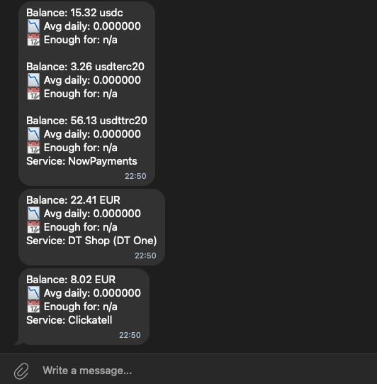

# FundsPulse

Go utility that polls multiple provider APIs, stores daily spending history per service, and sends balance summaries to Telegram users.

## Features
- Service definitions driven by a YAML configuration file (HTTP request data and JSON fields to extract).
- Daily scheduler powered by go-quartz with timezone support.
- History writer that keeps the last _N_ days of spend per provider in JSON files (no database required).
- Telegram notifications using telego, with configurable chat recipients.

- Structured logging via iSlogger.
- Static monthly payment reminders for services without APIs.

## Configuration
Create a configuration file (for example `config.yaml`) based on [`config.example.yaml`](config.example.yaml) and provide:
- Global settings: `days_for_avg`, `minimum_days_left`, `history_dir`.
- `schedule` time in `HH:MM` (24h) and optional `timezone`.
- Telegram bot token and the list of chat IDs to notify.
- Service entries describing HTTP request details and the JSON path to the balance (`response.balance_path`).
- Optional `static_services` entries for fixed monthly payments.

Environment variables can be referenced inside headers, query params, URLs, and request bodies (e.g. `${NOWPAYMENTS_API_KEY}`). The checker automatically loads values from a local `.env` file if present.

Each history file is written inside `history_dir`. The checker clips data to `days_for_avg` entries and calculates average spend and days of balance remaining. When the remaining days number drops below `minimum_days_left`, the Telegram message ends with `!!!`.
Services can define `billing_mode` to adjust messaging for postpaid balances (`prepaid` by default, `postpaid` shows debt and skips "days left").

## Running
Build or run directly:

1. Copy `.env.example` to `.env` and fill in provider secrets (or export the variables manually).
2. Start the checker:

   ```bash
   go run ./cmd/balance-checker -config config.yaml
   ```

   The process installs a daily job according to the configured time and keeps running until interrupted (Ctrl+C, SIGTERM, etc.).

To execute a single check immediately and exit, pass `-run-once`:

```bash
go run ./cmd/balance-checker -config config.yaml -run-once
```

If `.env` is missing the app still starts; any undefined placeholders expand to empty strings, so double-check that all required values are provided.

Logs are stored under `logs/` by default. History files are created under the configured directory (default `data/`).

## Filling Service Definitions
For each provider, supply:
- `request.method`, `request.url`, headers, query parameters, optional JSON body, and optional `timeout_seconds`.
- `response.balance_path` – a [gjson](https://github.com/tidwall/gjson) path pointing to the numeric balance in the API response.
- Optional `response.currency_field` if the API returns currency code, and/or `currency_symbol` to enforce a prefix like `$` in reports.
- Set `response.multiple: true` when the balance path yields an array. Each value is tracked independently, with currencies taken from `currency_field` (arrays are supported) or `currency_symbol` as fallback.
- Optional `billing_mode: postpaid` to treat negative balances as debt without "days left" calculation.

Adjust the example configuration to match real API responses from:
[presets_services](presets_services)
Ensure the Telegram bot token and chat IDs are valid before running the checker.

## Static Services
For fixed monthly payments without an API, add entries under `static_services`:
- `name`, `currency_symbol`, `amount`
- `billing_day` (1-31)
- `notify_before_days` (0+)
- `url_pay`, `card_pay` (optional)

The checker sends a reminder on `billing_day` and `notify_before_days` before it.
